# PEPA — User Guide

> Complete guide to working with the PEPA platform.

---

## Table of Contents

1. [Getting Started](#getting-started)
2. [Authentication & Admin](#authentication--admin)
3. [Dashboard](#dashboard)
4. [Service Catalog](#service-catalog)
5. [Deploying Services](#deploying-services)
6. [Kubernetes Clusters](#kubernetes-clusters)
7. [Connections & Integrations](#connections--integrations)
8. [CI/CD Pipelines](#cicd-pipelines)
9. [GitOps Workflows](#gitops-workflows)
10. [Workflow Engine](#workflow-engine)
11. [Scorecards](#scorecards)
12. [RBAC — Roles & Permissions](#rbac--roles--permissions)
13. [Settings](#settings)
14. [AI Assistant](#ai-assistant)
15. [Plugin System](#plugin-system)
16. [Troubleshooting](#troubleshooting)
17. [FAQ](#faq)

---

## Getting Started

### Prerequisites

- Docker & Docker Compose (recommended), or Go 1.26+ / Node.js 22+ / PostgreSQL 16+

### Installation (Docker)

```bash
git clone https://github.com/akotau/pepa.git
cd pepa
make docker-up
```

Access the portal at **http://localhost:3000**

> 📸 **Screenshot suggestion**: Terminal showing `make docker-up` output with all services starting

### Local Development

```bash
# Start infrastructure
docker compose -f deployments/compose/docker-compose.yml up -d postgres redis minio minio-init

# Build and run API
make build && make run-api

# Run worker (separate terminal)
make run-worker

# Run frontend (separate terminal)
cd frontend && npm install && npm run dev
```

### Architecture Overview

```
┌─────────────┐     ┌──────────────┐     ┌──────────────┐
│   Frontend   │────▶│  API Server  │────▶│  PostgreSQL  │
│  (Next.js)   │     │   (Gin/Go)   │     │  + PGvector  │
│  Port 3000   │     │  Port 8080   │     │  Port 5432   │
└─────────────┘     └──────┬───────┘     └──────────────┘
                           │
                    ┌──────┴───────┐
                    │              │
              ┌─────▼─────┐ ┌─────▼─────┐
              │   Redis    │ │   MinIO   │
              │ (Queue)    │ │ (S3/Art.) │
              └───────────┘ └───────────┘
```

---

## Authentication & Admin

### Initial Setup

On first login, you'll be prompted to set up the admin account:

> 📸 **Screenshot suggestion**: Initial setup page with admin account creation form

1. Navigate to **http://localhost:3000/setup**
2. Create the admin account with email and password
3. After setup, you're redirected to the Dashboard

### Default Admin Account

| Field | Value |
|-------|-------|
| Email | `admin@pepa.dev` |
| Password | Set during initial setup |
| Role | Platform Admin (Super Admin) |

### Logging In

1. Navigate to **http://localhost:3000/login**
2. Enter admin email and password
3. After login, you are redirected to the Dashboard

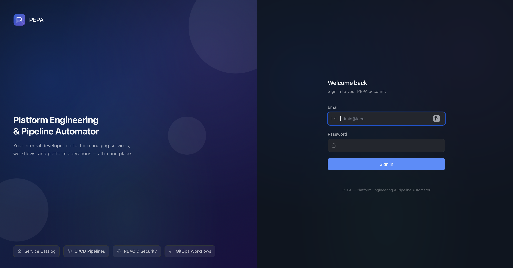

### Admin User Management

Go to **Settings → Users** to:
- Create new users with name, email, password, and role
- Activate / deactivate user accounts
- Reset user passwords
- Search and filter users

> 📸 **Screenshot suggestion**: Users management page showing user list with actions

### Roles

| Role | Access |
|------|--------|
| **Admin** | Full access to all resources and actions |
| **Developer** | Create/read/update services, workflows, deployments |
| **Viewer** | Read-only access to all resources |

---

## Dashboard

The Dashboard is the main landing page showing platform overview.

### What You See

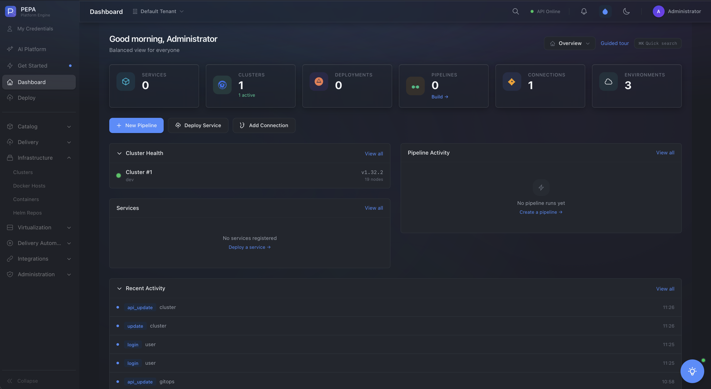

```
┌─────────────────────────────────────────────────────┐
│  Dashboard                                          │
├──────────┬──────────┬──────────┬──────────┬─────────┤
│ Services │ Clusters │Deployments│Pipelines │  AI    │
│    12    │     3    │    47    │     8    │ Chat   │
├──────────┴──────────┴──────────┴──────────┴─────────┤
│                                                     │
│  Deployment Frequency Chart                         │
│  ████████░░ 78%                                     │
│                                                     │
│  Recent Activity                                    │
│  • api-gateway deployed to production    2m ago     │
│  • user-service scaled to 3 replicas     15m ago    │
│  • payment-service health check passed   1h ago     │
│                                                     │
└─────────────────────────────────────────────────────┘
```

### Key Metrics

- **Services** — total registered services
- **Clusters** — connected Kubernetes clusters
- **Deployments** — active deployments across environments
- **Pipelines** — CI/CD pipelines configured
- **AI Chat** — quick access to AI assistant

### Customization

The dashboard supports personalization:
- Drag and drop widgets to reorder
- Click widget settings to customize
- Choose which metrics to display
- Set default view for your role

> 📸 **Screenshot suggestion**: Dashboard customization mode with widget drag handles visible

---

## Service Catalog

### Viewing Services

Navigate to **Services** to see all registered services.

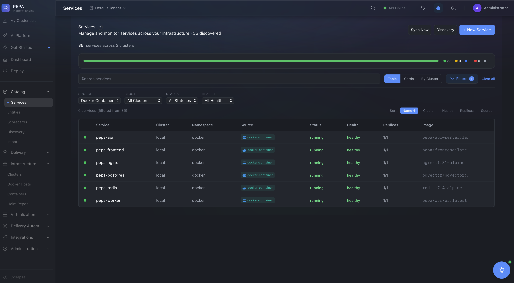

```
┌─────────────────────────────────────────────────────┐
│  Services                    [+ Deploy Service]     │
├─────────────────────────────────────────────────────┤
│  Search: [________________]                         │
├──────────┬────────┬───────┬────────┬───────────────┤
│  Name    │  Type  │ Owner │ Status │   Health      │
├──────────┼────────┼───────┼────────┼───────────────┤
│ api-gw   │ API    │ Team1 │ ● Active│ ✓ Healthy    │
│ user-svc │ API    │ Team2 │ ● Active│ ✓ Healthy    │
│ pay-svc  │ API    │ Team1 │ ● Active│ ⚠ Degraded   │
│ docs     │ Static │ Team3 │ ● Active│ ✓ Healthy    │
└──────────┴────────┴───────┴────────┴───────────────┘
```

### Service Details

Click any service to see:
- Metadata (owner, team, lifecycle stage)
- Relationships to other services (graph view)
- Deployment history
- Health check results
- Scorecard evaluation

> 📸 **Screenshot suggestion**: Service detail page showing metadata, health, and relationships

### Creating a Service

1. Click **Deploy** or **Services → Deploy Service**
2. Choose a template:
   - **Node.js API** — Express, 200m CPU, 256Mi RAM
   - **Go API** — Gin, 100m CPU, 128Mi RAM
   - **Python API** — FastAPI, 200m CPU, 256Mi RAM
   - **Static Site** — HTML, 50m CPU, 64Mi RAM
   - **Helm Import** — Import existing Helm chart
3. Fill in service name, team, and configuration
4. Click **Deploy**

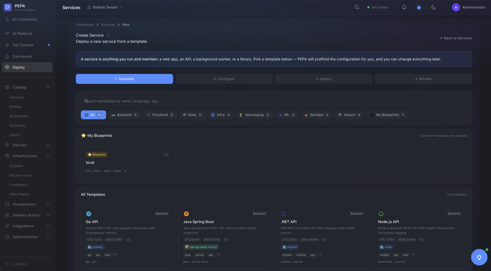

### Service Templates

Templates provide pre-configured service setups:

| Template | CPU | Memory | Description |
|----------|-----|--------|-------------|
| Node.js API | 200m | 256Mi | Express.js REST API |
| Go API | 100m | 128Mi | Gin framework API |
| Python API | 200m | 256Mi | FastAPI application |
| Static Site | 50m | 64Mi | HTML/CSS/JS site |
| Helm Import | Custom | Custom | Import existing chart |

---

## Deploying Services

### Deployment Flow

```
  User Action       Platform          Infrastructure
  ───────────       ────────          ──────────────
  Create Service ──▶ Validate ──────▶ Check Cluster
       │                │                  │
       ▼                ▼                  ▼
  Choose Template ─▶ Generate ──────▶ Push to Git
       │           Manifests              │
       ▼                │                 ▼
  Configure ──────▶ Store Config ──▶ FluxCD Syncs
       │                                  │
       ▼                                  ▼
  Deploy ──────────────────────────▶ K8s Reconciles
```

> 📸 **Screenshot suggestion**: Deployment progress view showing stages

### Environments

| Environment | Purpose | Auto-deploy |
|-------------|---------|-------------|
| Development | Testing | Yes |
| Staging | Pre-production | With approval |
| Production | Live | Manual approval |

> 📸 **Screenshot suggestion**: Environment selection during deployment

### Deployment History

View all deployments at **Deployments**. Each entry shows:
- Service name and version
- Target environment and cluster
- Status (Running / Succeeded / Failed)
- Duration and logs

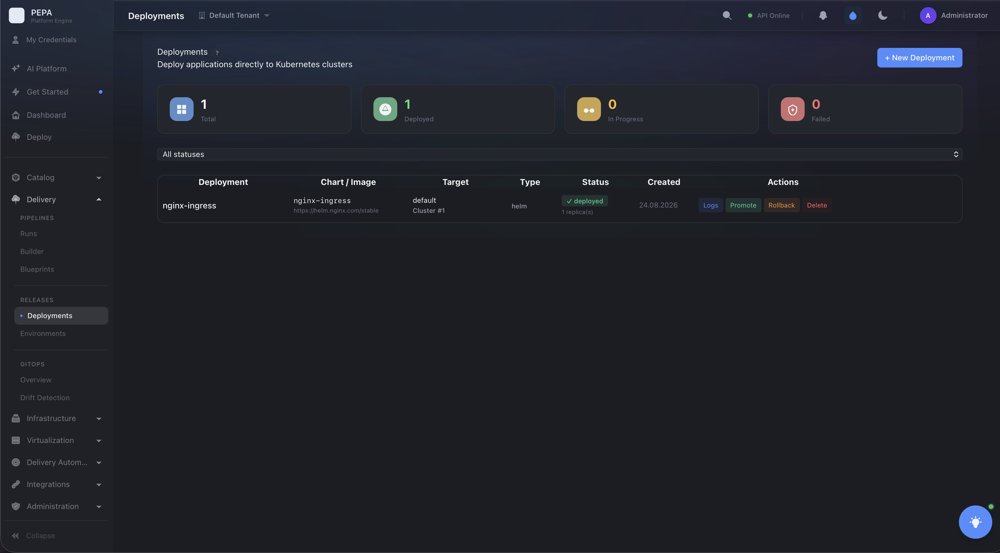

### Deployment Logs

Click any deployment to see detailed logs:
- Real-time log streaming
- Step-by-step execution
- Error messages and stack traces
- Rollback options

> 📸 **Screenshot suggestion**: Deployment log viewer with real-time updates

---

## Kubernetes Clusters

### Adding a Cluster

1. Go to **Clusters → Add Cluster**
2. Upload kubeconfig file or paste contents
3. The platform parses the config and discovers:
   - Cluster name and endpoint
   - Available namespaces
   - Node count and resources
4. Click **Connect**

> 📸 **Screenshot suggestion**: Cluster addition form with kubeconfig upload

### Cluster View

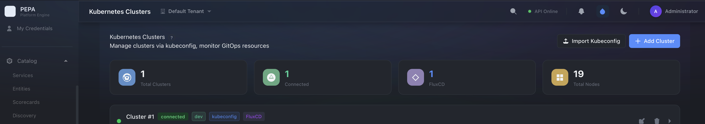

```
┌─────────────────────────────────────────────────┐
│  Cluster: production-east                       │
├─────────────────────────────────────────────────┤
│  Status:  ● Connected                           │
│  Endpoint: https://k8s.example.com:6443         │
│  Version:  v1.28.3                              │
├─────────────────────────────────────────────────┤
│  Nodes (3)          Namespaces (5)              │
│  ├─ node-1 (4 CPU)  ├─ default                 │
│  ├─ node-2 (4 CPU)  ├─ production              │
│  └─ node-3 (8 CPU)  ├─ staging                 │
│                       ├─ monitoring             │
│                       └─ kube-system            │
├─────────────────────────────────────────────────┤
│  Resource Usage                                 │
│  CPU:    ████████░░ 65%                         │
│  Memory: ██████░░░░ 48%                         │
│  Pods:   █████░░░░░ 38%                         │
└─────────────────────────────────────────────────┘
```

### Health Monitoring

Clusters are checked in real-time. Health indicators:
- **Connected** — API server reachable
- **Disconnected** — Cannot reach API server
- **Degraded** — High error rate or latency

> 📸 **Screenshot suggestion**: Cluster list with health status indicators

### Cluster Actions

From the cluster view, you can:
- View detailed node information
- Inspect namespace resources
- Check pod status and logs
- Monitor resource usage over time
- Disconnect or reconfigure

---

## Connections & Integrations

### Connection Types

| Type | Description | Configuration |
|------|-------------|---------------|
| Kubernetes | Cluster access | Kubeconfig file |
| GitLab | Git + CI/CD | URL + Token |
| GitHub | Git + Actions | URL + Token |
| Jira | Issue tracking | URL + Token |
| AI Provider | LLM access | API Key |
| Storage | S3/MinIO | Endpoint + Keys |
| Vault | Secret management | URL + Token |


### Managing Connections

Go to **Connections** to:
- View all configured connections
- Add new connections with encrypted credential storage
- Test connection health
- Edit or remove connections

> 📸 **Screenshot suggestion**: Connection creation form with test button

### Connection Health

Each connection shows a status indicator:
- **Green** — Healthy and operational
- **Yellow** — Degraded or slow
- **Red** — Unreachable or misconfigured

> 📸 **Screenshot suggestion**: Connection list with health status colors

### Testing Connections

Click **Test** on any connection to verify:
- Connectivity to the external service
- Authentication credentials
- Permissions and access levels
- Response time

> 📸 **Screenshot suggestion**: Connection test result modal showing success/failure

---

## CI/CD Pipelines

### Pipeline Overview

Navigate to **Pipelines** to see all configured CI/CD pipelines.

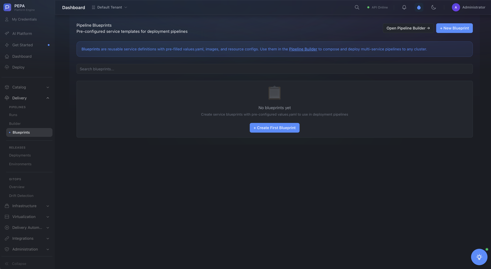

### Pipeline Structure

```
  checkout → build → test → approval → deploy → notify
     │         │       │        │          │        │
     ▼         ▼       ▼        ▼          ▼        ▼
   Git      Compile   Unit   Manual     K8s/Helm  Slack
   pull     + lint   tests   gate       apply     alert
```

> 📸 **Screenshot suggestion**: Visual pipeline representation

### Pipeline Blueprints

Pre-built templates:
- **CI/CD Pipeline** — Full build-test-deploy flow
- **Security Scan** — Dependency audit + SAST + container scan
- **Rollback** — Revert to previous version with verification

> 📸 **Screenshot suggestion**: Pipeline blueprints catalog

### Creating a Pipeline

1. Go to **Pipelines → New Pipeline**
2. Choose a blueprint or start from scratch
3. Configure stages and steps
4. Set environment variables
5. Save and activate


### Viewing Pipeline Runs

Click any pipeline to see:
- Run history with status (success/failed/running)
- Step-by-step execution log
- Duration per step
- Artifacts and outputs

> 📸 **Screenshot suggestion**: Pipeline run detail with step logs

### Pipeline Logs

Detailed logs show:
- Each step's output
- Error messages and stack traces
- Timing information
- Resource usage

> 📸 **Screenshot suggestion**: Pipeline log viewer with step expansion

---

## GitOps Workflows

### GitOps Overview

PEPA uses GitOps principles for deployments:

```
  Git Repository (Single Source of Truth)
       │
       ▼
  FluxCD Agent (watches for changes)
       │
       ▼
  Kubernetes Cluster (applies desired state)
       │
       ▼
  Verification (health checks + rollback)
```

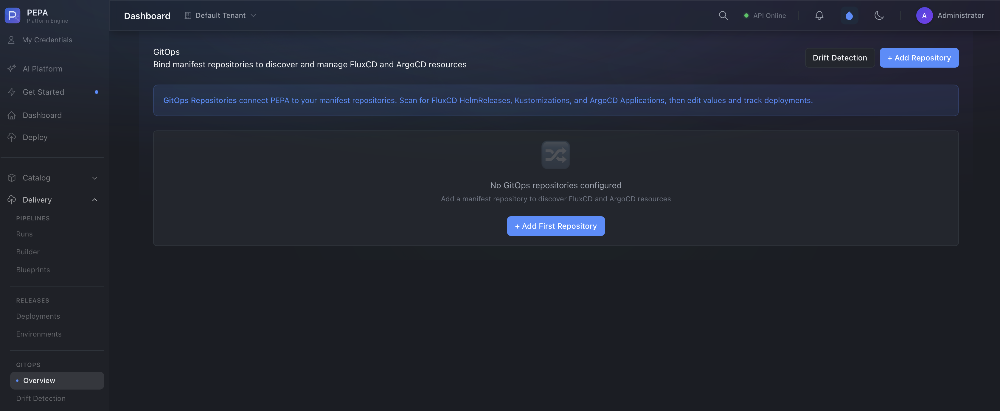

### Drift Detection

Navigate to **GitOps → Drift Detection** to:
- See differences between Git state and live cluster state
- Identify manual changes that bypassed GitOps
- Trigger reconciliation to restore desired state

> 📸 **Screenshot suggestion**: Drift detection results showing differences

### Repository Configuration

1. Go to **GitOps** and select a repository
2. Configure the branch and path to monitor
3. Set sync interval and auto-heal options
4. PEPA validates the configuration and starts watching

> 📸 **Screenshot suggestion**: GitOps repository configuration form

### Sync Status

View sync status for each repository:
- Last sync time
- Sync result (success/failed)
- Pending changes
- Health status

> 📸 **Screenshot suggestion**: GitOps sync status dashboard

---

## Workflow Engine

### Creating a Workflow

1. Go to **Workflows → Create Workflow**
2. Use the visual DAG editor or YAML
3. Define steps, conditions, and approvals
4. Save and activate

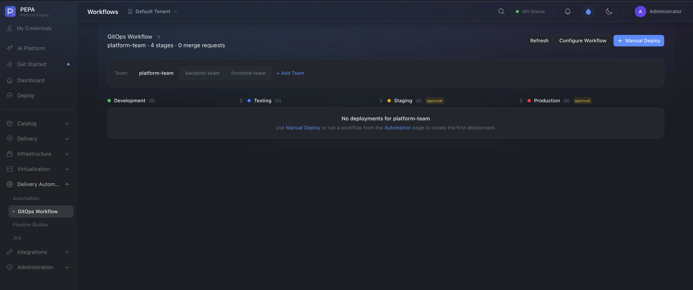

### Visual Workflow Designer

The designer provides a drag-and-drop interface:
- Drag steps from the palette
- Connect steps with edges
- Configure each step in the properties panel
- Preview YAML in real-time

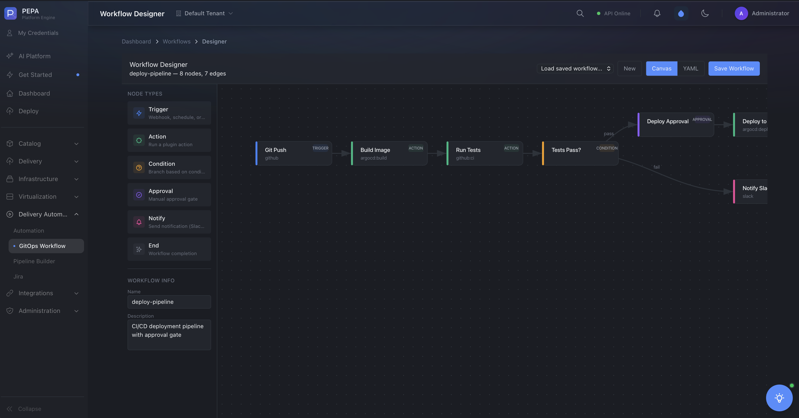

### Workflow Templates

| Template | Steps |
|----------|-------|
| CI/CD Pipeline | checkout → build → test → approval → deploy → notify |
| Security Scan | checkout → dep_audit + sast + container_scan → report |
| Entity Onboarding | validate → scorecard → notify_team |
| Rollback | get_previous → rollback → verify → notify |
| Compliance Check | fetch → check → report → notify |

> 📸 **Screenshot suggestion**: Workflow templates library

### Workflow Execution

```
  ┌─────────┐    ┌─────────┐    ┌─────────┐
  │ Step 1  │───▶│ Step 2  │───▶│ Step 3  │
  │ Build   │    │ Test    │    │ Deploy  │
  └─────────┘    └────┬────┘    └─────────┘
                       │
                  ┌────▼────┐
                  │ Approval│
                  │ (manual)│
                  └─────────┘
```

> 📸 **Screenshot suggestion**: Workflow execution view with step status

### Workflow Logs

View execution logs:
- Real-time step progress
- Step outputs and errors
- Approval status and comments
- Rollback triggers

> 📸 **Screenshot suggestion**: Workflow execution logs

---

## Scorecards

### Production Readiness

Scorecards evaluate services against weighted rules:

| Rule | Weight | Severity |
|------|--------|----------|
| Health endpoint | High | Error |
| Readiness endpoint | High | Error |
| Owner team assigned | Medium | Warning |
| Resource limits set | Medium | Warning |
| Replica count ≥ 2 | Medium | Warning |
| GitLab project linked | Low | Info |
| Helm chart linked | Low | Warning |
| Deployment strategy | Low | Info |
| Environment variables | Low | Info |

> 📸 **Screenshot suggestion**: Scorecard rules configuration

### Score Levels

| Level | Threshold | Badge |
|-------|-----------|-------|
| Bronze | 25% | 🥉 |
| Silver | 50% | 🥈 |
| Gold | 75% | 🥇 |
| Platinum | 90% | 💎 |

> 📸 **Screenshot suggestion**: Service with scorecard badge

### Viewing Scorecards

Navigate to **Scorecards** to:
- See all scorecards
- View evaluation results
- Configure rules and weights
- Track improvements over time

> 📸 **Screenshot suggestion**: Scorecard evaluation results

---

## RBAC — Roles & Permissions

### Managing Roles

Go to **Settings → Users** or **Roles** in the sidebar.

> 📸 **Screenshot suggestion**: Roles management page

### Default Roles

| Role | Permissions |
|------|-------------|
| **Platform Admin** | All resources, all actions |
| **Developer** | Services, workflows, deployments — create/read/update |
| **Viewer** | All resources — read only |

### Creating Custom Roles

1. Go to **Roles → Create Role**
2. Define the role name and description
3. Select resource permissions:
   - Services: create, read, update, delete
   - Clusters: read, manage
   - Workflows: create, execute, view
   - Settings: view, admin
4. Save the role
5. Assign to users via **Settings → Users**

> 📸 **Screenshot suggestion**: Custom role creation form with permission matrix

### Permission Matrix

The permission matrix shows:
- Resources (rows)
- Actions (columns)
- Checkboxes for each permission

> 📸 **Screenshot suggestion**: Permission matrix with checkboxes

---

## Settings

### General Settings

| Setting | Description |
|---------|-------------|
| Platform Name | Displayed in sidebar and titles |
| Base URL | API server URL for plugins/webhooks |
| Log Level | debug / info / warn / error |
| CORS Origins | Allowed cross-origin request sources |

> 📸 **Screenshot suggestion**: General settings page

### AI Configuration

Configure AI providers (OpenAI, Anthropic, etc.) for the AI Assistant.

> 📸 **Screenshot suggestion**: AI provider configuration form

### Environment Management

Manage deployment environments (dev, staging, production) with variables and constraints.

> 📸 **Screenshot suggestion**: Environment management page

### Team Management

Create teams, assign members, and associate teams with services.

> 📸 **Screenshot suggestion**: Team management interface

---

## AI Assistant

### Using the AI Assistant

1. Navigate to **AI Assistant** or click the AI icon
2. Ask questions about your infrastructure:
   - "What services are unhealthy?"
   - "Show me deployment history for api-gateway"
   - "Generate a Helm values file for a Node.js service"
3. The AI uses your platform context to provide accurate answers


### RAG Framework

PEPA uses Retrieval-Augmented Generation with PGvector embeddings to:
- Index your service catalog and documentation
- Provide context-aware responses
- Learn from your infrastructure patterns

### AI Tools

Built-in tools:
- **catalog_query** — Query the service catalog
- **deployment_action** — Trigger deployments
- **cluster_info** — Get cluster information
- **workflow_execute** — Execute workflows
- **diagnostics** — Run diagnostics

> 📸 **Screenshot suggestion**: AI tools list with descriptions

---

## Plugin System

### Built-in Plugins

| Plugin | Purpose |
|--------|---------|
| Slack | Notifications and alerts |
| ArgoCD | GitOps deployment sync |
| GitHub | Repository integration |
| GitLab | Repository + CI/CD integration |
| Jira | Issue tracking integration |
| Bitbucket | Repository integration |
| Gitea | Repository integration |
| FluxCD | GitOps deployment sync |
| Prometheus | Monitoring and metrics |
| Proxmox | Virtualization management |

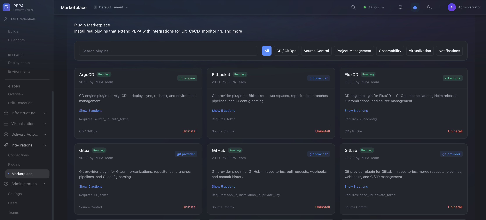

### Installing Plugins

1. Go to **Plugins** or **Marketplace**
2. Browse available plugins
3. Click **Install** on the desired plugin
4. Configure the plugin connection settings
5. Enable the plugin

> 📸 **Screenshot suggestion**: Plugin installation modal

### Developing Custom Plugins

```go
package main

import sdk "github.com/pepa/pepa/internal/plugin/sdk-go"

type MyPlugin struct{}

func (p *MyPlugin) Name() string    { return "my-plugin" }
func (p *MyPlugin) Version() string { return "0.1.0" }
func (p *MyPlugin) Actions() []sdk.Action { /* ... */ }

func main() {
    sdk.Register(&MyPlugin{})
    sdk.Serve()
}
```

> 📸 **Screenshot suggestion**: Plugin development setup

---

## Troubleshooting

### Common Issues

#### 1. Cannot connect to Kubernetes cluster

**Symptoms:** Cluster shows "Disconnected" status

**Solutions:**
- Verify kubeconfig is valid: `kubectl --kubeconfig=<file> get nodes`
- Check network connectivity to the cluster API server
- Ensure the kubeconfig has sufficient RBAC permissions
- Re-upload the kubeconfig if expired

#### 2. Frontend shows blank page or fails to load

**Symptoms:** White screen, console errors

**Solutions:**
- Clear browser cache and cookies
- Check that the API server is running: `curl http://localhost:8080/healthz`
- Verify `NEXT_PUBLIC_API_URL` environment variable
- Check browser console for CORS errors — update `CORS_ORIGINS` in config

#### 3. Pipeline fails at "deploy" step

**Symptoms:** Pipeline shows red at deploy step

**Solutions:**
- Check cluster connectivity in **Connections**
- Verify the target namespace exists in the cluster
- Ensure FluxCD is installed and running in the cluster
- Check pipeline logs for specific Kubernetes errors

#### 4. AI Assistant returns errors

**Symptoms:** AI chat shows "Failed to get response"

**Solutions:**
- Verify AI provider API key is configured in **Settings → AI**
- Check network connectivity to the AI provider endpoint
- Ensure the AI provider account has sufficient credits/quota

#### 5. Database connection refused

**Symptoms:** API returns 500 errors, logs show "connection refused"

**Solutions:**
- Verify PostgreSQL is running: `docker compose ps`
- Check `POSTGRES_HOST`, `POSTGRES_PORT`, `POSTGRES_PASSWORD` env vars
- Ensure the database exists: `psql -h localhost -U pepa -l`
- Run migrations: `psql -h localhost -U pepa -d pepa -f migrations/001_initial_schema.sql`

#### 6. Plugin fails to load

**Symptoms:** Plugin shows "Error" status

**Solutions:**
- Check plugin binary exists in the `plugins/` directory
- Verify the plugin is compiled for the correct architecture
- Check API server logs for plugin load errors
- Reinstall the plugin from the Marketplace

#### 7. GitOps drift detected

**Symptoms:** Drift Detection shows differences

**Solutions:**
- Review the drift details to understand what changed
- If change was intentional, update the Git repository to match
- If change was accidental, trigger reconciliation from the GitOps page
- Consider enabling auto-heal to automatically reconcile drift

---

## FAQ

### How do I reset the admin password?

Use the CLI:
```bash
./bin/pepa user reset-password --email admin@pepa.dev --password newpassword
```

Or via the API:
```bash
curl -X PUT http://localhost:8080/api/v1/users/<id>/password \
  -H "Content-Type: application/json" \
  -d '{"password": "newpassword"}'
```

### How do I add a new environment?

Go to **Settings → Environments → Create Environment**. Specify name, variables, and constraints.

### Can I import existing Helm charts?

Yes. Use the **Helm Import** template when creating a service, or add a Helm repository at **Helm Repos**.

### How do I enable production mode?

Set environment variables:
```bash
SERVER_ENV=production
DEV_MODE=false
JWT_SECRET=your-secret-key
```

### How do I backup the database?

```bash
docker compose exec postgres pg_dump -U pepa pepa > backup_$(date +%Y%m%d).sql
```

### How do I scale the API server?

The API server is stateless. Run multiple instances behind a load balancer:
```bash
docker compose -f docker-compose.prod.yml up --scale api=3 -d
```

---

## Configuration Reference

| Variable | Default | Description |
|----------|---------|-------------|
| `SERVER_PORT` | `8080` | API server port |
| `SERVER_ENV` | `development` | Environment mode |
| `DEV_MODE` | `true` | Skip JWT auth (dev only) |
| `LOG_LEVEL` | `info` | Log verbosity |
| `POSTGRES_HOST` | `localhost` | PostgreSQL host |
| `POSTGRES_PORT` | `5432` | PostgreSQL port |
| `POSTGRES_DB` | `pepa` | Database name |
| `POSTGRES_USER` | `pepa` | Database user |
| `POSTGRES_PASSWORD` | — | Database password |
| `REDIS_HOST` | `localhost` | Redis host |
| `REDIS_PORT` | `6379` | Redis port |
| `JWT_SECRET` | — | JWT signing key |
| `S3_ENDPOINT` | — | MinIO/S3 endpoint |
| `CORS_ORIGINS` | `*` | Allowed CORS origins |
| `PLUGIN_DIR` | `./plugins` | Plugin directory |

---

*PEPA — Platform Engineering & Pipeline Automator. Built for teams who value developer experience.*
